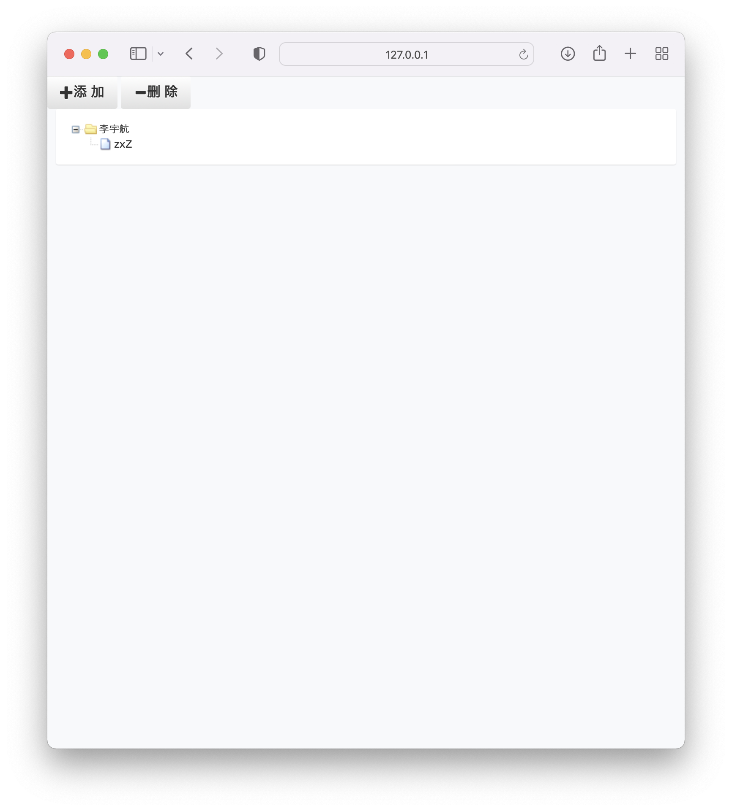

# Django-zTree app
在实现其他项目的过程中，发觉zTree应该挺常用的，但是网上没有别人做好的，或者做的不是很完善

所以我就做了个稍微完善一点的，将该部分的代码摘录出来了。

## 使用
0. install python3,`cd`到当前目录
1. `pip install -r requirements.txt`
2. `python manage.py runserver`

## 展示

